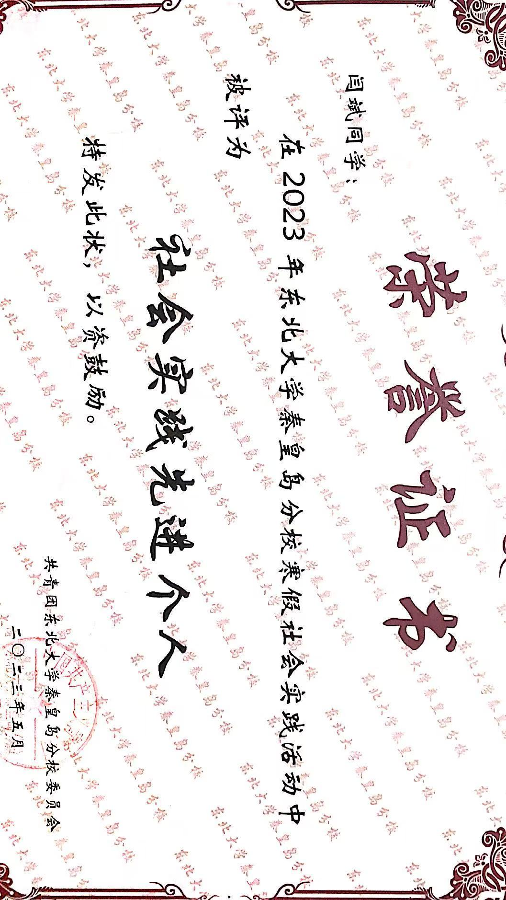
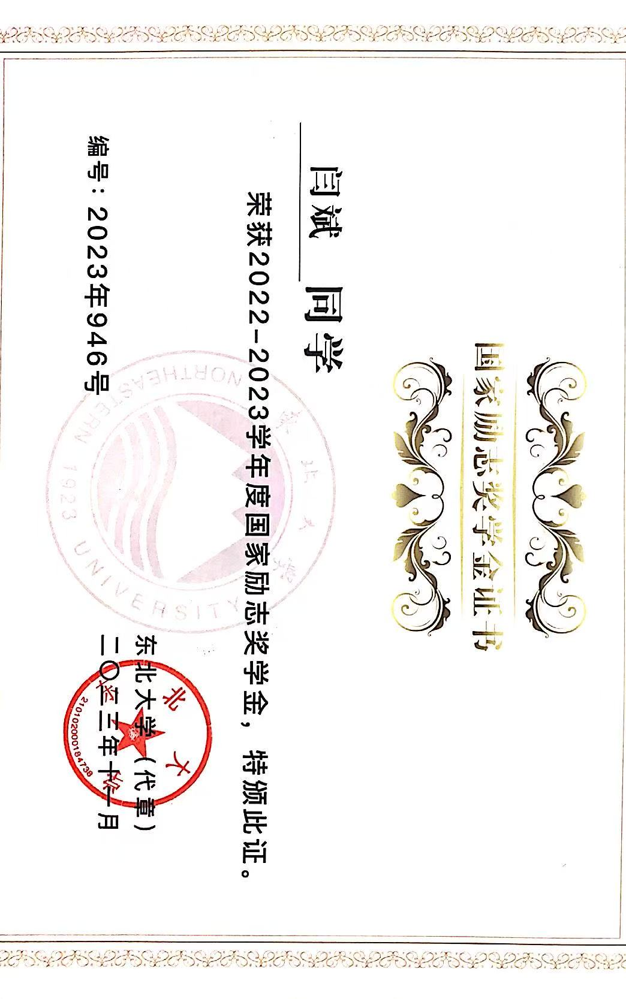
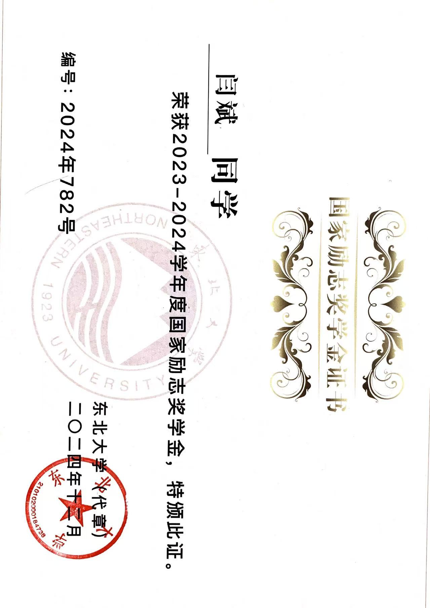
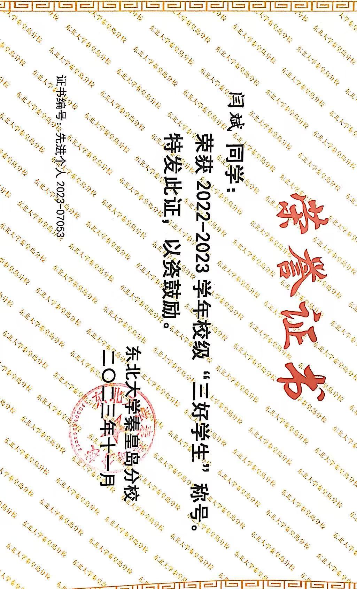
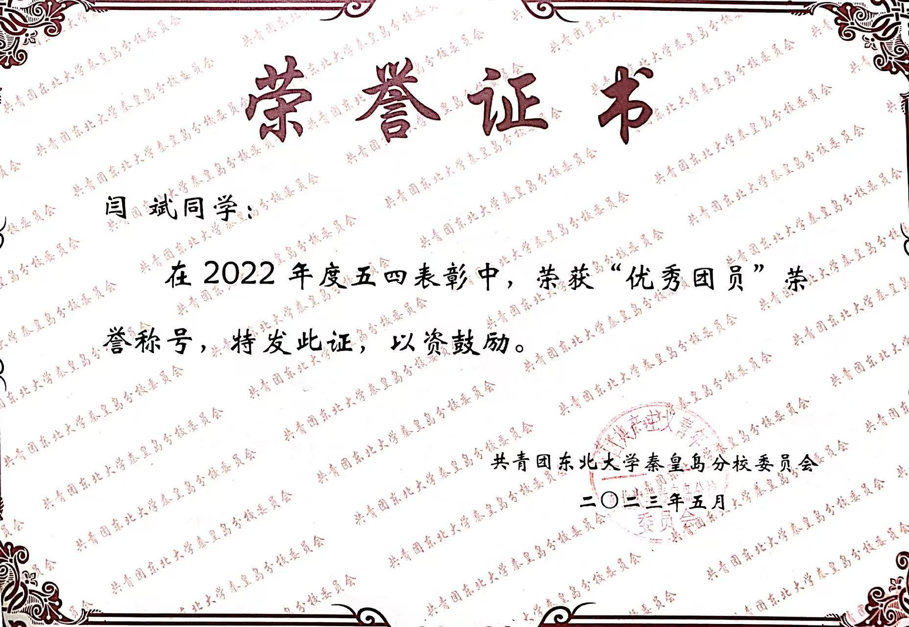
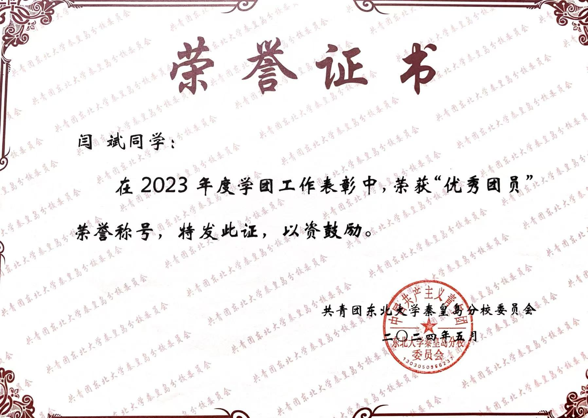
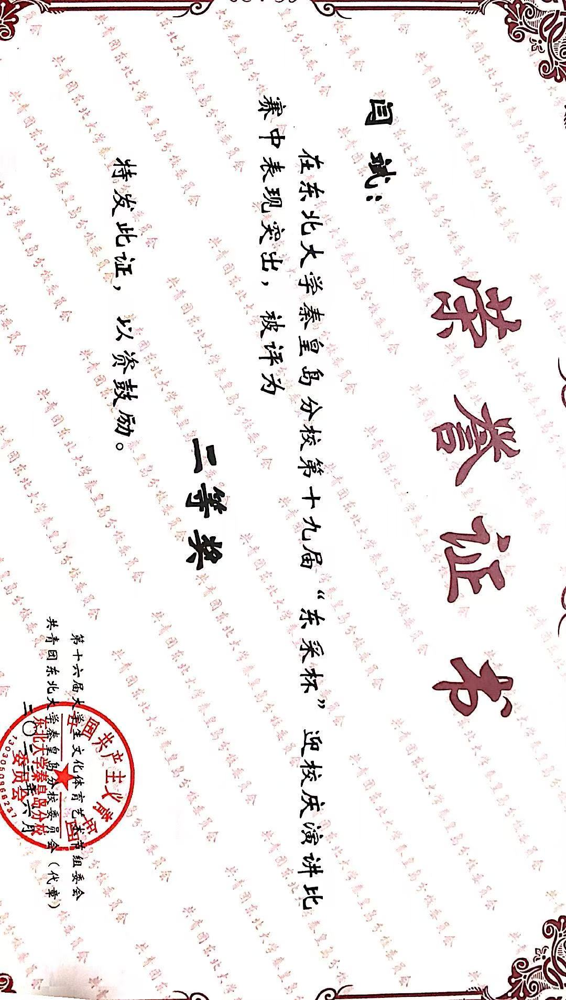

I'm a third year undergraduate student from Northeastern University, majoring in computer science and technology. My research interest includes LLM, deep learning and so on.

[Wechat](../images/Wechat.png) 

## 📚 Academic Performance

Here are some of the core courses I’ve completed with results:

| Course                          | Grade |
|---------------------------------|-------|
| Probability Theory              | 99    |
| Linear Algebra                  | 94    |
| C++ Programming                 | 98    |
| Introduction to Artificial Intelligence | 100   |
| Operating Systems               | 96    |
| Computer Organization Principles| 100   |
| Database Systems                | 97    |

GPA: 4.169 / 5.00

## 🏅 Honors & Awards

I’m honored to have received several awards in recognition of both my academic excellence and social contributions:

- 🌟 Outstanding Individual in Social Practice
      
- 🎓 National Endeavor Scholarship

  [2023-2024]
   
  [2022-2023]
 
- 🥇 All-Round Excellent Student (Three-Good Student: Good Morality, Good Study, Good Health)
     
- 🏅 Excellent Communist Youth League Member
  
  [2022-2023]
  
  [2023-2024]
   

## 🎤 Campus Life

Beyond academics, I actively participate in various extracurricular activities that help me grow as a communicator, team player, and all-round student. Notable achievements include:

- 🥈 Second Prize in University-level Speech Contest
    
- 🥇 First Prize in University-level Speech Contest
     
- 🥈 Second Prize in University-level Group Aerobics Competition

- 🥈 Second Prize in University-level Recitation Contest

